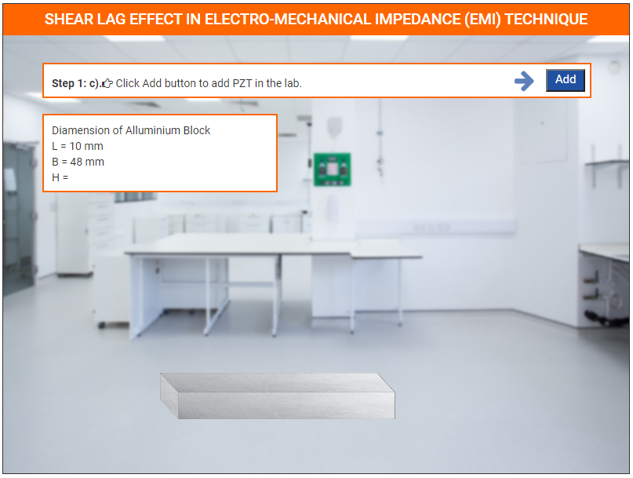
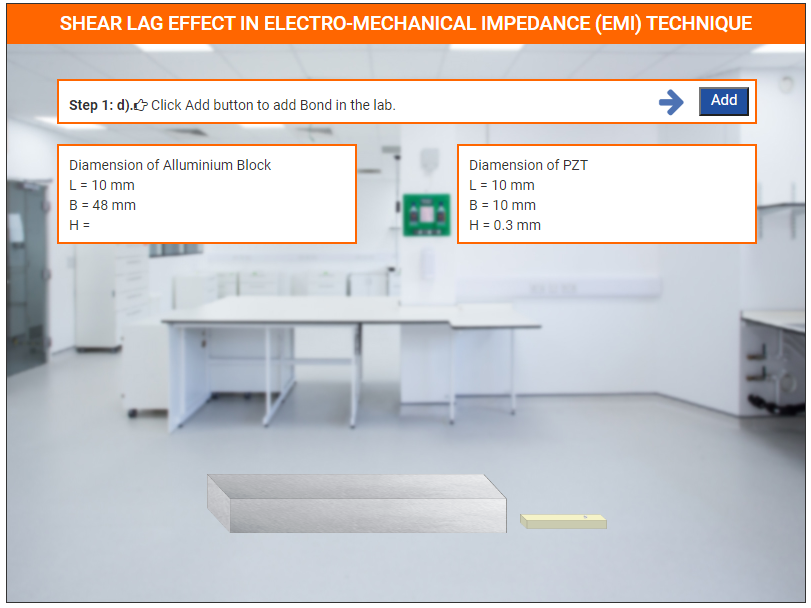
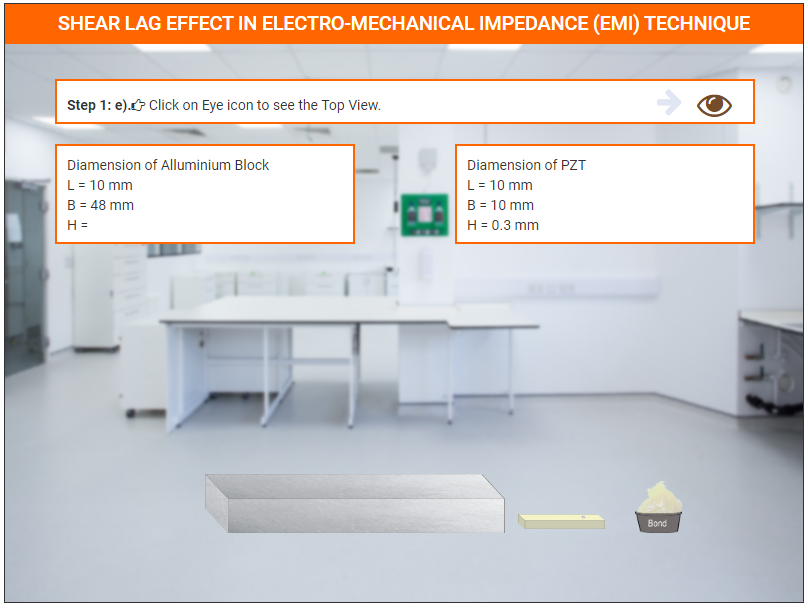
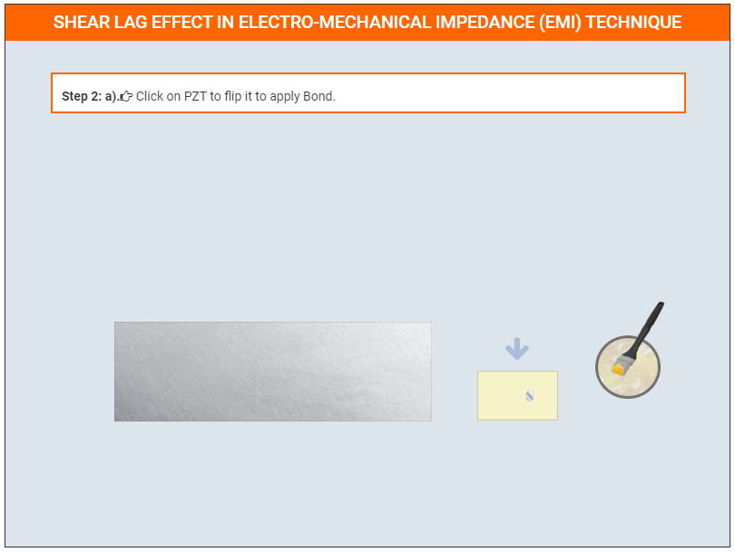
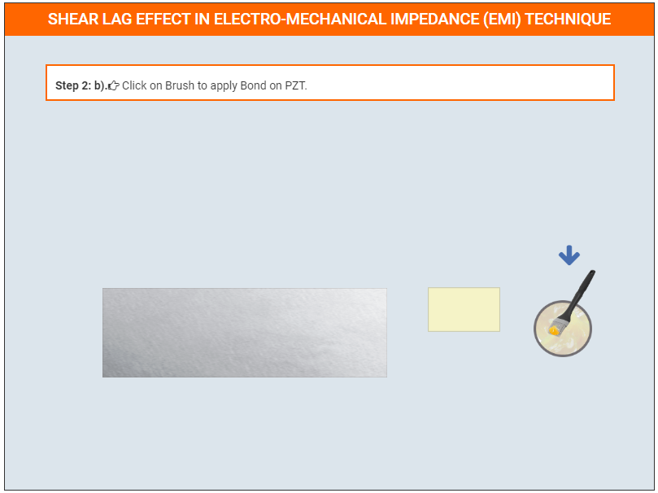
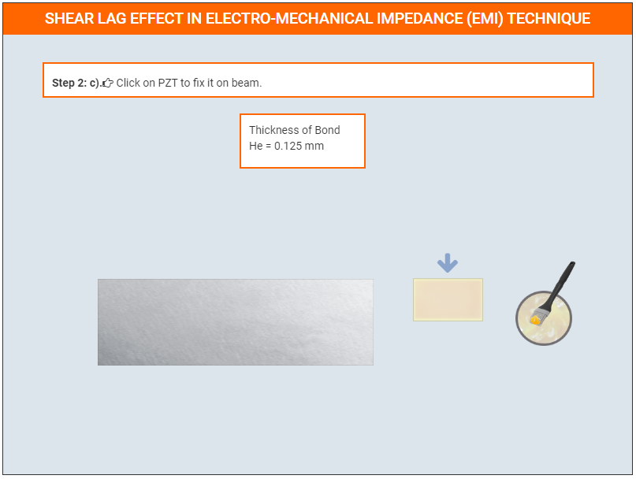
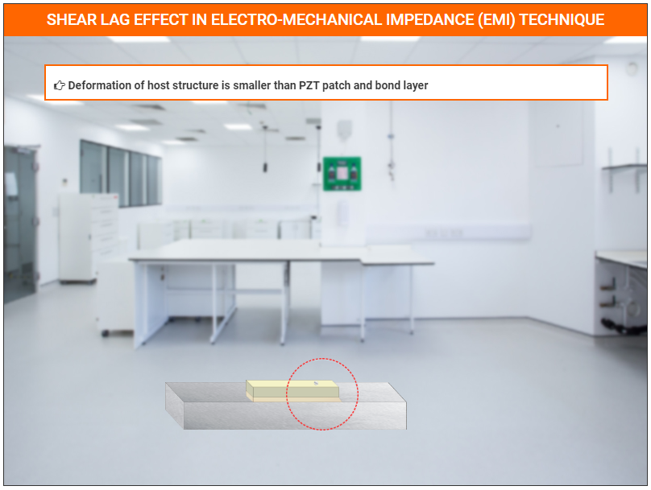
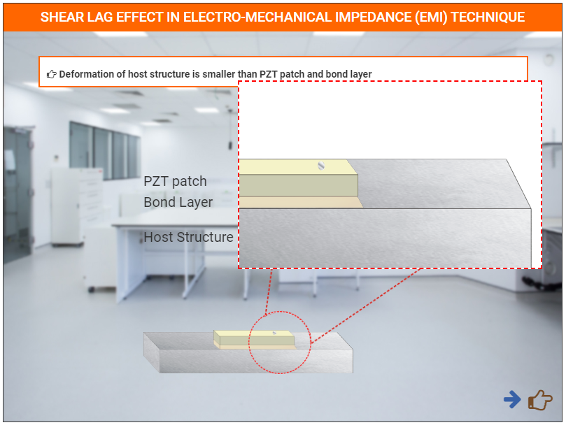
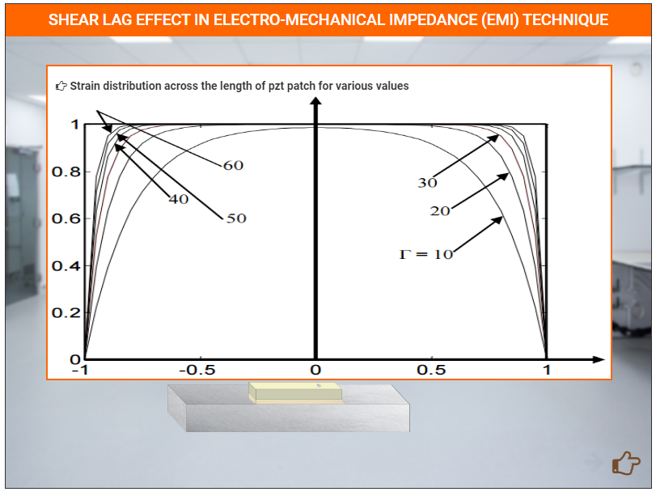
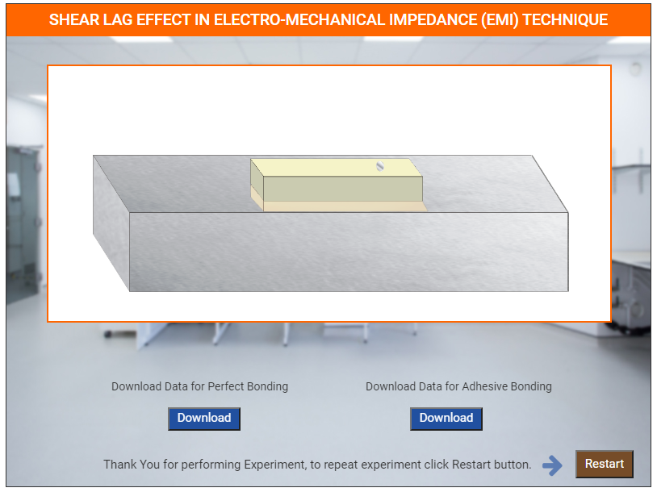

### These steps will be followed for the experiment

**PRE EXPRIMENT QUIZ QUESTIONS**
	
1) What is shear lag effect?
2) How does thickness of bond layer affect strain transfer to/from the PZT patch to the structure?
3) How does the Young’s modulus of elasticity of bond layer affect strain transfer to/from the PZT patch to the structure?

#### Preparation of specimens:

Click on Start Experiment button to start the experiment.

Step 1: a). Click on Add button to add Beam in the lab.
Step 1: b). Click on Beam to arrange them in right position.

Step 1: c). Click Add button to add PZT in the lab.

Step 1: d). Click Add button to add Bond in the lab.

Step 1: e). Click on Eye icon to see the Top View.

Step 2: a). Click on PZT to flip it to apply Bond.

Step 2: b). Click on Brush to apply Bond on PZT.

Step 2: c). Click on PZT to fix it on beam.

Step 2: d). Click on Eye icon to see the Side View.

 

Click on next button to show graph

Graph

Click on Download button to download data.
After Click Restart button

**POST EXPRIMENT QUIZ QUESTIONS**

1) How does the presence of bond layer affect conductance signature as
compared to perfect bonding case?
2) How do the Young’s modulus of elasticity and the thickness of bond
layer affect the sharpness of peaks of conductance signature?