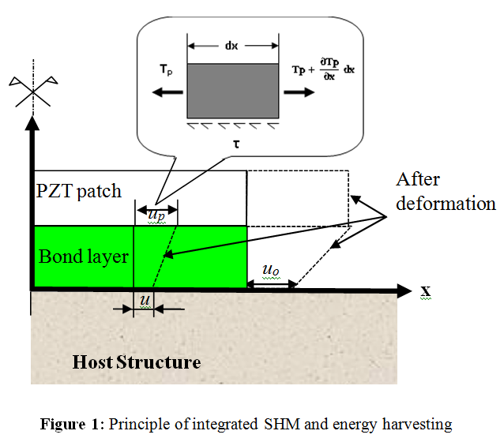
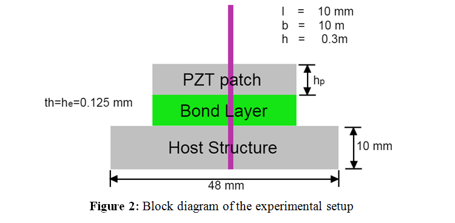
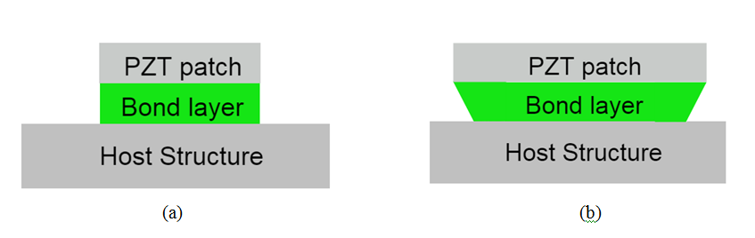

### EXPERIMENTAL METHODOLOGY
	
OVERVIEW
The phenomenon of difference in the strain induced in the PZT patch from that in the host structure is called as shear lag effect. Figure 1 illustrates the process of actuation of a PZT patch by application of external voltage. As can be seen from the figure, the displacement induced on the surface of the host structure(µo) is lesser than that in the PZT patch (µPo) more about shear lag effect, the user may refer the doctoral thesis of Dr.Sumedha Moharana (http://web.iitd.ac.in/~sbhalla/thesispdf/sumedha.pdf).

**EXPERIMENTAL PROCEDURE**

The simulations in this experiment are based on the analytical model developed by Dr.SumedhaMoharana. A host structure considered in this experiment on which the PZT patch is attached using epoxy adhesive as shown in Figure 2. The phenomenon of shear lag can be visualized with the help of animation as illustrated in Figure 2. The user can then derive simulated signatures for various bonding conditions, plot them in excel and visualize the effect of shear lag.

Figure 3: System in (a) Undeformed condition (b) After deformation

The deformation of the host structure is slower than the PZT patch and the bond layer. 

<a href="images/description.pdf">More...</a>
 
